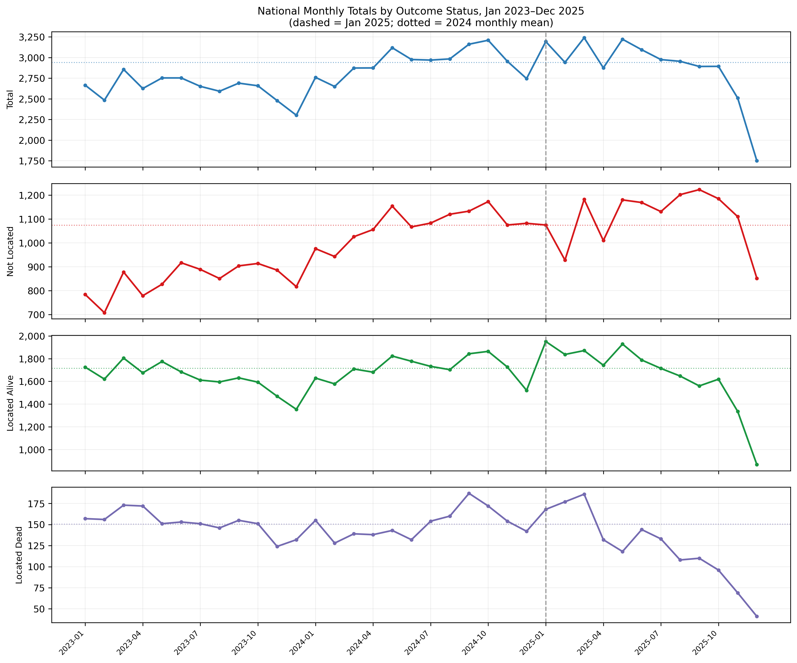

# 09 — Endpoint Diagnosis: Nov–Dec 2025 Data Quality
Generated: 2026-03-18
Purpose: Document late-2025 monthly trends to inform study endpoint decision.
Data source: panel_monthly_counts.parquet | Status 0=Total, 7=Not Located, 2=Located Alive, 3=Located Dead

---

## Section 1 — Monthly National Totals (Jan 2023–Dec 2025)

| Year | Month | Total | Not Located | Located Alive | Located Dead |
|------|-------|-------|-------------|---------------|--------------|
| 2023 | Jan | 2,665 | 784 | 1,725 | 157 |
| 2023 | Feb | 2,484 | 708 | 1,620 | 156 |
| 2023 | Mar | 2,856 | 878 | 1,805 | 173 |
| 2023 | Apr | 2,625 | 779 | 1,675 | 172 |
| 2023 | May | 2,753 | 827 | 1,775 | 151 |
| 2023 | Jun | 2,753 | 917 | 1,683 | 153 |
| 2023 | Jul | 2,651 | 889 | 1,611 | 151 |
| 2023 | Aug | 2,592 | 851 | 1,595 | 146 |
| 2023 | Sep | 2,690 | 904 | 1,631 | 155 |
| 2023 | Oct | 2,658 | 914 | 1,593 | 151 |
| 2023 | Nov | 2,479 | 886 | 1,469 | 124 |
| 2023 | Dec | 2,302 | 817 | 1,354 | 132 |
| 2024 | Jan | 2,760 | 976 | 1,629 | 155 |
| 2024 | Feb | 2,649 | 943 | 1,578 | 128 |
| 2024 | Mar | 2,873 | 1,026 | 1,709 | 139 |
| 2024 | Apr | 2,874 | 1,056 | 1,681 | 138 |
| 2024 | May | 3,118 | 1,154 | 1,823 | 143 |
| 2024 | Jun | 2,976 | 1,067 | 1,777 | 132 |
| 2024 | Jul | 2,969 | 1,083 | 1,732 | 154 |
| 2024 | Aug | 2,983 | 1,120 | 1,703 | 160 |
| 2024 | Sep | 3,161 | 1,133 | 1,843 | 187 |
| 2024 | Oct | 3,209 | 1,173 | 1,864 | 172 |
| 2024 | Nov | 2,954 | 1,075 | 1,726 | 154 |
| 2024 | Dec | 2,745 | 1,082 | 1,521 | 142 |
| 2025 | Jan | 3,193 | 1,075 | 1,951 | 168 |
| 2025 | Feb | 2,941 | 928 | 1,837 | 177 |
| 2025 | Mar | 3,239 | 1,182 | 1,871 | 186 |
| 2025 | Apr | 2,875 | 1,010 | 1,742 | 132 |
| 2025 | May | 3,221 | 1,180 | 1,928 | 118 |
| 2025 | Jun | 3,094 | 1,169 | 1,788 | 144 |
| 2025 | Jul | 2,975 | 1,131 | 1,714 | 133 |
| 2025 | Aug | 2,954 | 1,202 | 1,647 | 108 |
| 2025 | Sep | 2,892 | 1,223 | 1,560 | 110 |
| 2025 | Oct | 2,893 | 1,185 | 1,619 | 96 |
| 2025 | Nov | 2,510 | 1,110 | 1,336 | 69 |
| 2025 | Dec | 1,750 | 852 | 868 | 41 |

Full data also saved in: `09_monthly_totals_2023_2025.csv`

---

## Section 2 — 2024 Baseline (12 months)

| Status | Mean | SD | Min | Max |
|--------|------|----|-----|-----|
| Total (0) | 2,939.2 | 163.6 | 2,649 | 3,209 |
| Not Located (7) | 1,074.0 | 65.4 | 943 | 1,173 |
| Located Alive (2) | 1,715.5 | 99.8 | 1,521 | 1,864 |
| Located Dead (3) | 150.3 | 16.3 | 128 | 187 |

Note: 2024 Nov (Total=2,954) and Dec (Total=2,745) are within normal range,
confirming that late-year seasonal dip exists in 2024 but is modest (−6.3% to −7.0% vs mean).

---

## Section 3 — 2025 Month-by-Month vs 2024 Mean

| Month | Total | % vs 2024 | Not Located | % | Located Alive | % | Located Dead | % |
|-------|-------|-----------|-------------|---|---------------|---|--------------|---|
| Jan | 3,193 | +8.6% | 1,075 | +0.1% | 1,951 | +13.7% | 168 | +11.8% |
| Feb | 2,941 | +0.1% | 928 | −13.6% | 1,837 | +7.1% | 177 | +17.7% |
| Mar | 3,239 | +10.2% | 1,182 | +10.1% | 1,871 | +9.1% | 186 | +23.7% |
| Apr | 2,875 | −2.2% | 1,010 | −6.0% | 1,742 | +1.5% | 132 | −12.2% |
| May | 3,221 | +9.6% | 1,180 | +9.9% | 1,928 | +12.4% | 118 | −21.5% |
| Jun | 3,094 | +5.3% | 1,169 | +8.8% | 1,788 | +4.2% | 144 | −4.2% |
| Jul | 2,975 | +1.2% | 1,131 | +5.3% | 1,714 | −0.1% | 133 | −11.5% |
| Aug | 2,954 | +0.5% | 1,202 | +11.9% | 1,647 | −4.0% | 108 | −28.2% |
| Sep | 2,892 | −1.6% | 1,223 | +13.9% | 1,560 | −9.1% | 110 | −26.8% |
| Oct | 2,893 | −1.6% | 1,185 | +10.3% | 1,619 | −5.6% | 96 | −36.1% |
| **Nov** | **2,510** | **−14.6%** | **1,110** | **+3.4%** | **1,336** | **−22.1%** | **69** | **−54.1%** |
| **Dec** | **1,750** | **−40.5%** | **852** | **−20.7%** | **868** | **−49.4%** | **41** | **−72.7%** |

---

## Section 4 — Description of Observed Patterns

### Jan–Oct 2025: largely normal

January through October 2025 show national totals within or above the 2024 range.
Total monthly cases fluctuate between 2,875 and 3,239 — consistent with the 2024
range of 2,649–3,209. Not Located shows a positive trend throughout 2025 Jan–Oct
(+0.1% to +13.9% vs 2024 mean). Located Alive Jan–Jun is above 2024 mean; Jul–Oct
shows a gradual softening (−0.1% to −9.1%).

**Located Dead diverges from Jan 2025 onward.** While Total and Not Located remain
normal through October, Located Dead begins declining from May 2025:
May=118 (−21.5%), Jun=144 (−4.2%), Jul=133 (−11.5%), Aug=108 (−28.2%),
Sep=110 (−26.8%), Oct=96 (−36.1%). The 2024 Located Dead range was 128–187;
Oct 2025 (96) is already below the 2024 minimum.

### Nov 2025: abrupt multi-status decline

November 2025 shows a break across all four statuses that is sharper than any
seasonal pattern observed in 2023 or 2024:
- Total: 2,510 (−14.6% vs 2024 mean; 2024-Nov was 2,954, only −0.5% above mean)
- Not Located: 1,110 (+3.4% — the only status NOT in decline)
- Located Alive: 1,336 (−22.1%; 2024-Nov was 1,726)
- Located Dead: 69 (−54.1%; 2024-Nov was 154)

For comparison, the seasonal dip in Nov 2023 was Total=2,479 (no 2022 baseline
available here, but consistent with 2023 mid-year levels). Nov 2025 Total=2,510
is similar in absolute terms to Nov 2023=2,479, but the composition is very different:
Located Alive collapsed while Not Located held.

### Dec 2025: extreme collapse across all statuses

December 2025 shows the most extreme deviations in the entire dataset:
- Total: 1,750 (−40.5% vs 2024 mean; 2024-Dec was 2,745)
- Not Located: 852 (−20.7%; 2024-Dec was 1,082)
- Located Alive: 868 (−49.4%; 2024-Dec was 1,521)
- Located Dead: 41 (−72.7%; 2024-Dec was 142)

The Dec 2024 dip was modest and within the normal seasonal range (−6.3% vs mean).
The Dec 2025 collapse is 6× deeper for Total and is not consistent with seasonal patterns.
It affects all four statuses simultaneously, with Located Dead most extreme (41 cases
nationally vs a 2024 mean of 150.3 — a drop of 72.7%).

### Structure of the decline

- **Not Located** is the most robust: holds near 2024 levels through October,
  shows only −20.7% in December.
- **Located Alive** begins softening in July, accelerates in September–October,
  collapses in November–December (−22% and −49%).
- **Located Dead** is the earliest and most severe decline: below 2024 minimum by
  October, −54% in November, −73% in December.
- The December 2025 Located Dead count (41) is lower than any month in the
  full 132-month panel (prior minimum was 46, in early 2015 when the registry
  was newly operational).

The pattern — gradual deterioration from mid-2025 for Located Dead, abrupt
multi-status collapse in November–December — is consistent with a lag between
event occurrence and registry update, where the most recent months have not yet
been fully populated. The effect is most severe for statuses that require
institutional processing (locating a body = forensic + registry chain) versus
active report filing (Not Located = family report, faster registry cycle).

---

## Section 5 — Time Series Plot

Vertical dashed line = January 2025. Dotted horizontal lines = 2024 monthly mean per status.
The collapse in November–December 2025 is visually unambiguous across all four panels.
