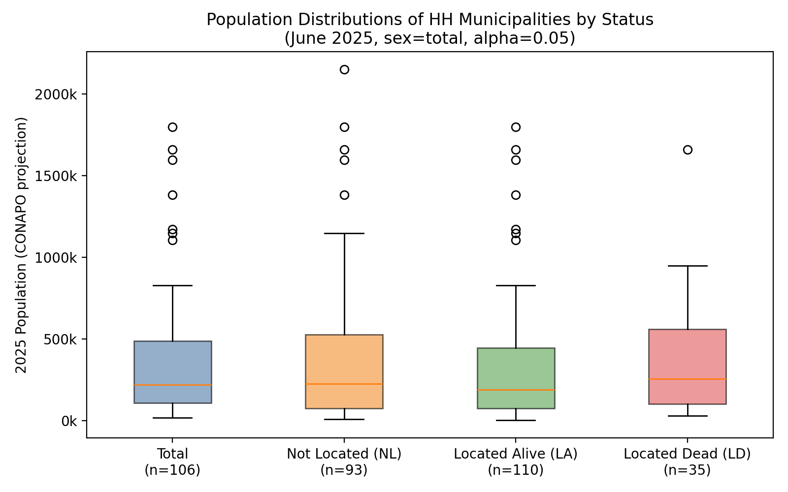

# Task 1a -- Population Distribution Comparison of HH Sets

**Date:** 2026-04-09

**Cross-section:** June 2025, sex=total, alpha=0.05

## 1. Descriptive Statistics (2025 CONAPO projections)

| Status | N HH | Median | P25 | P75 | Min | Max | Mean |
|--------|------|--------|-----|-----|-----|-----|------|
| Total | 106 | 219,823 | 106,968 | 488,913 | 18,716 | 1,800,823 | 358,118 |
| Not Located (NL) | 93 | 226,484 | 75,231 | 527,700 | 9,804 | 2,151,740 | 384,510 |
| Located Alive (LA) | 110 | 188,117 | 76,241 | 444,574 | 1,004 | 1,800,823 | 330,015 |
| Located Dead (LD) | 35 | 255,796 | 103,353 | 559,120 | 28,693 | 1,661,406 | 356,307 |

## 2. Pairwise Mann-Whitney U Tests

| Comparison | U | p-value | Rank-biserial r | Interpretation |
|------------|---|---------|-----------------|----------------|
| LD HH vs NL HH | 1,690 | 0.7403 | -0.038 | not significant |
| LD HH vs LA HH | 2,070 | 0.5029 | -0.076 | not significant |
| NL HH vs LA HH | 5,316 | 0.6307 | -0.039 | not significant |

## 3. Pairwise Kolmogorov-Smirnov Tests

| Comparison | D | p-value | Interpretation |
|------------|---|---------|----------------|
| LD HH vs NL HH | 0.090 | 0.9698 | not significant |
| LD HH vs LA HH | 0.136 | 0.6513 | not significant |
| NL HH vs LA HH | 0.083 | 0.8386 | not significant |

## 4. Decision

**All pairwise Mann-Whitney U p > 0.05.** Population distributions do not differ significantly across HH status categories. Population size cannot explain Jaccard overlap patterns.

**STOP. Write footnote. Skip Task 1b.**

### Suggested footnote

> Mann-Whitney U tests comparing 2025 CONAPO population projections across HH municipality sets (Total, NL, LA, LD; June 2025, alpha = 0.05) found no significant pairwise differences (all p > 0.05), indicating that municipal population size does not drive cluster membership.

## 5. Box Plot

## Task 4 -- Poisson Trend Robustness

**Date:** 2026-04-09

**Method:** Poisson GLM with robust (HC1) SE vs OLS with Newey-West HAC (bw=12)

| Series | OLS slope/yr | OLS p | Poisson IRR | Poisson p | Sign consistent |
|--------|-------------|-------|-------------|-----------|-----------------|
| Centro NL | +4.78 | 0.0000 | 1.2326 | 0.0000 | Yes |
| Centro Total | +3.28 | 0.0004 | 1.0799 | 0.0000 | Yes |
| Bajio29 Total | -0.52 | 0.1993 | 0.9062 | 0.0005 | Yes |
| Norte LD | +0.92 | 0.0000 | 1.2351 | 0.0000 | Yes |

**IRR interpretation:** IRR > 1 means increasing trend; IRR < 1 means decreasing.
Sign consistency checks whether OLS and Poisson agree on direction (or both NS).
